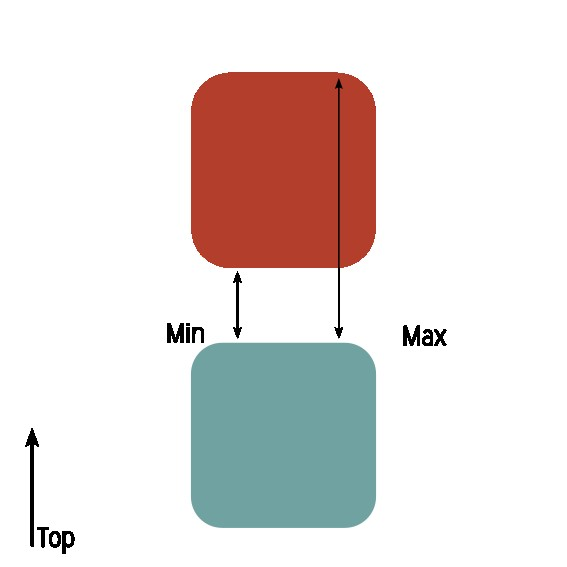

<<<<<<< HEAD
---
Synthese: Nothing must be higher than
2 Objects Rules: true
Must X: true
IsRule: true
Priority: 1
---
=======
>>>>>>> f353ab426d8ae177bda4a60783011c9b4a030455
# Description

This rule aims to detect objects that are on top of each other. 

![[image_Page 1.png]]
It will first detect, on each object, the face that will be anaylzed. The lateral tolerance may be use to consider more face than the one directly above.
- All faces must point to the top, or bottom.
- The faces must be the highest, or lower, point of the geometry.
	- The faces of an holes point to the top but aren't the highest point of the geometry.

<<<<<<< HEAD
Then it will check the distance between all the faces.
=======

The rule will detect the two faces of the object. Those two faces will be analyze in order to detect if they are in or out.

>>>>>>> f353ab426d8ae177bda4a60783011c9b4a030455
# Property
A: Object A
B: Object B

Type: 
- MinToMax: The lower part of A will be collided with the highest part of B.
- MinToMin : The lower part of A will be collided with the lowest part of B.
- MaxToMin : The highest part of A will be collided with the lowest part of B.
- MaxToMax : The highest part of A will be collided with the highest part of B.

![[image_Page 2.png]]

Min : If the faces of object B is higher than min, it will raise a clash.
Max : if the faces of object B is lower than Max, it will raise a clash.

Lateral_Tolerance: 
By default 0, the lateral tolerance aims to detect that the B object may be offset. 
If the value is negative, it can enforce that the B object is under A object.
![[image_Page 3.png]]

# Result

For now, the result will say if B is on top of A and give the minium distance between the two objects.

# Example
It can be used to detect if a pipe is right above an electric machine.
